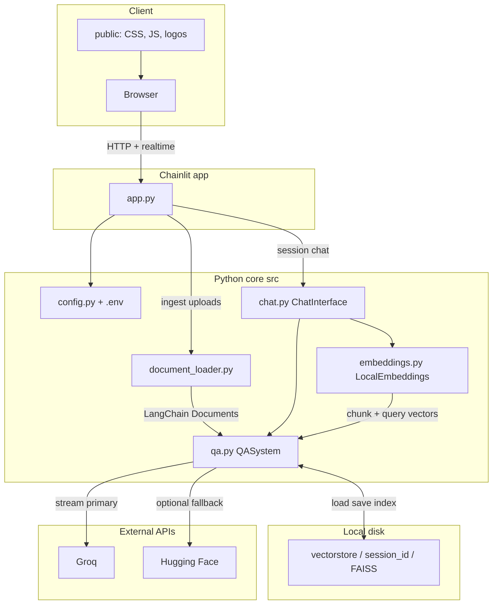

# AI Doc Assistant

Chainlit app for **question answering over your own files**. You upload documents, the app indexes them with **local embeddings + FAISS**, then answers in chat using **Groq** (streaming when configured) with **Hugging Face** fallbacks.

## Features

- **Formats:** PDF, TXT, Markdown, CSV/TSV, HTML, JSON, XML, **DOCX**, **XLSX**, **XLS**, **PPTX**. Legacy **.doc** is not supported—save as **.docx** or **PDF** first.
- **Session index:** one vector store per Chainlit session under `vectorstore/<session_id>/`. **Add more documents** merges new uploads into the same index.
- **Retrieval:** similarity search with optional broader retrieval for summaries and multi-file balancing for compare-style questions.
- **Answers:** grounded on your files; prompts steer plain language (e.g. “document” / “file”, not jargon like “excerpt”).
- **UI:** Custom header (logo + title), welcome splash, scroll helpers, and file-ask **Cancel** via `public/` assets and `.chainlit/config.toml` (see below).

## Architecture

High-level data flow: the browser talks to **Chainlit**; each chat session gets its own **FAISS** folder on disk. Uploads are parsed into chunks, embedded locally, and indexed. Questions trigger similarity search, then the model answers using **Groq** (streaming) or **Hugging Face** fallbacks.



**Ingest path:** `DocumentLoader` reads the file → splits into chunks → `QASystem.ingest_documents` embeds with `LocalEmbeddings` and appends to the session FAISS store.

**Query path:** user message → `retrieve_with_scores` (with optional multi-file balancing and chunk dedupe) → `context_from_docs` → `stream_answer_tokens` → Groq (or HF) → tokens streamed back to the UI.

## Project layout

| Path | Role |
|------|------|
| `app.py` | Chainlit entrypoint: chat start, ingest, retrieval, streaming replies |
| `chainlit.md` | Short in-product description for the UI |
| `src/config.py` | Env-driven limits (chunking, retrieval, Groq) |
| `src/qa.py` | Retrieval, deduped context, Groq/HF generation |
| `src/document_loader.py` | Parse uploads and chunk text |
| `src/chat.py`, `src/embeddings.py` | Chat wrapper, local SentenceTransformer embeddings |
| `public/` | `logo_light.svg` / `logo_dark.svg` (served as `/logo?theme=…`), `hide-readme.css`, `ask-file-in-plane-cancel.js` |
| `.chainlit/config.toml` | App name, theme, `custom_css` / `custom_js` pointing at `public/` |
| `tests/` | pytest (loader + QA mocks) |
| `Dockerfile`, `.dockerignore` | Optional container run |
| `requirements.txt`, `.env.example`, `pyproject.toml` | Dependencies and env template |

## Requirements

- macOS or Linux (Windows untested)
- **Python 3.10–3.13** (`requires-python` in `pyproject.toml`)
- Git

## Environment variables

Copy `.env.example` to `.env`. Do not commit `.env`.

| Variable | Purpose |
|----------|---------|
| `GROQ_API_KEY` | Groq API key (enables Groq + streaming) |
| `GROQ_MODEL` | Groq model id |
| `GROQ_MAX_TOKENS` | Max completion tokens (default in code is **3072** if unset) |
| `GROQ_TEMPERATURE` | Sampling temperature |
| `HUGGINGFACE_API_KEY` | HF token for hosted inference fallback |
| `RETRIEVER_K` | Default top‑k chunks |
| `RETRIEVER_K_OVERVIEW` | Larger k for broad “tell me about…” style questions |
| `RETRIEVER_K_MULTI` | k when comparing multiple files |
| `MULTI_FILE_CHUNKS_PER_FILE`, `MULTI_FILE_POOL_K` | Multi-file retrieval tuning |
| `DOC_CHUNK_SIZE`, `DOC_CHUNK_OVERLAP` | Text splitter settings |
| `EMBEDDING_MODEL` | Sentence-Transformers model id |
| `HF_LOCAL_MODEL` | Small local HF model if hosted calls fail |

## Quick start (local)

```bash
python3 -m venv venv
source venv/bin/activate   # Windows: venv\Scripts\activate
pip install --upgrade pip
pip install -r requirements.txt
cp .env.example .env       # then edit .env (at least GROQ_API_KEY for best experience)
chainlit run app.py
```

Always run **`pip install -r requirements.txt`** after cloning or switching venvs so Office formats work (**python-docx**, **openpyxl**, **python-pptx**, **xlrd**, etc.). If `.docx` fails with `No module named 'docx'`, dependencies were not installed.

Open **http://localhost:8000** (or the URL Chainlit prints). Upload when prompted, then ask questions.

## Tests

```bash
source venv/bin/activate
pytest
```

## Docker (optional)

```bash
docker build -t ai-doc-assistant .
docker run --rm -p 8000:8000 --env-file .env ai-doc-assistant
```

Then open **http://localhost:8000**.

## Logos and branding

Place **`public/logo_light.svg`** and **`public/logo_dark.svg`**. Chainlit serves them from **`/logo?theme=light`** and **`/logo?theme=dark`**. The custom JS/CSS also uses them in the header and first-load splash.

## Optional: isolated Groq tooling venv

```bash
python3 -m venv .venv_groq
source .venv_groq/bin/activate
pip install --upgrade pip
pip install groq httpx
# set GROQ_API_KEY and GROQ_MODEL in this shell before testing Groq
```
